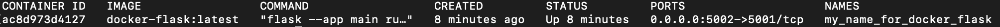
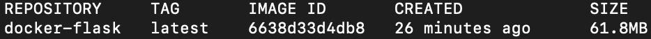
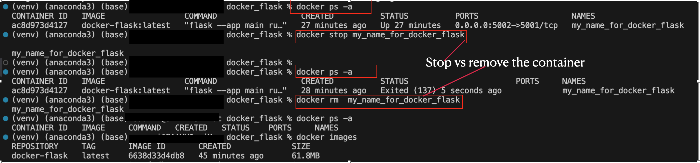

 ###  Dependencies 
dockers installed , reference - https://docs.docker.com/guides/get-started/

### Python env
- `python -m venv venv` # create a virtual environment with name `venv`
- `source venv/bin/activate` # activate the virtual environment(mac), if are in other os [reference](https://docs.python.org/3/library/venv.html) 
-  `pip install Flask`
- `pip freeze > requirements.txt` # write dependencies to a file
### Hello world flask
create a hello world app in flask. refer main.py

### Dockerfile
go to docker hub and find python [docker_hub_python](https://hub.docker.com/_/python/tags)
select the right tag, selected ~~`3.13.0a4-alpine3.19`~~ python:3.10.13-alpine3.19
> before running build, make sure docker desktop is running

- run `docker build -t docker-flask .` # file with name Dockerfile and at current directory
    - or `docker build --no-cache -t docker-flask .  ` # for no cache
- `docker images` # return images , and will show docker-flask
- `docker run -d -p 5002:5001 --name my_name_for_docker_flask docker-flask:latest` # host_port:container_port
> flask is running at 5001 refer Dockerfile  `CMD ["flask" ,"--app" ,"main" ,"run", "--host","0.0.0.0", "--port","5001"]`, and its been mapped to 5002, so in browser access will be at 5002 - http://127.0.0.1:5002/

-----------------
interactive shell
- `docker run -it  -p 5002:5001 --name my_name_for_docker_flask docker-flask:latest sh`
- /app # `flask --app main run --host 0.0.0.0 --port 5001`
- on browser access `http://127.0.0.1:5002/`

### Other most frequent commands
- stop running container --> `docker stop my_name_for_docker_flask`
- remove --> `docker rm my_name_for_docker_flask`
- execute from shell - `docker run -it  -p 5002:5001 --name my_name_for_docker_flask docker-flask:latest sh`
-  list container(active) `docker ps`

- show images `docker images`

quick snap of executed commands:

### Note
- when access the end point, for example `http://127.0.0.1:5002/` and page not displayed or gives impression that container site is un accessible, look for the below error - "Segmentation fault", python crashed, most likly the issue is with container image. 

